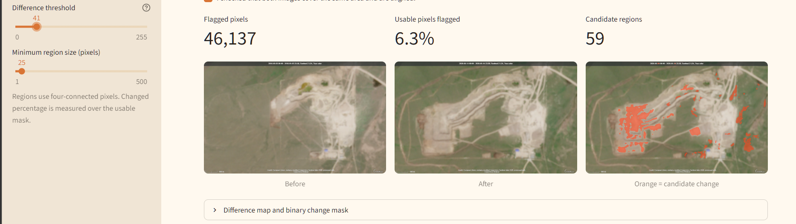
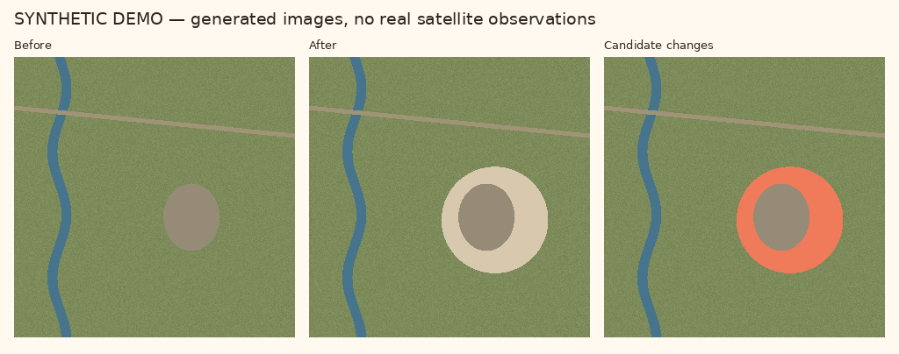

# Steppe Watch

A Python and Streamlit prototype for comparing satellite images and highlighting candidate land changes around mining sites in Kazakhstan.

**Status: v0.1 prototype.** The current version uses a classical RGB difference baseline. It compares two aligned images, highlights candidate visual changes, and exports a mask and a JSON report. A preliminary visual experiment has been run on a site near Kokshetau. Training and evaluating a machine learning model is planned for a later version.

## Preliminary experiment near Kokshetau

Two satellite images of a mining site near Kokshetau, Kazakhstan, were compared at two difference thresholds. The minimum region size was kept at **25 pixels** for both runs. The results below were recorded from the application screenshots.

| Difference threshold | Minimum region size | Flagged pixels | Usable pixels flagged | Candidate regions |
| --- | --- | --- | --- | --- |
| 35 | 25 pixels | 78,860 | 10.8% | 75 |
| 41 | 25 pixels | 46,137 | 6.3% | 59 |

### Threshold 35


### Threshold 41



Increasing the threshold reduced the number of flagged pixels. This demonstrates sensitivity to the threshold; it does not establish which setting is more accurate. Reference annotations are needed to distinguish actual land changes from effects such as illumination, vegetation, shadows or alignment differences.

**These percentages describe flagged pixels, not detection accuracy or the percentage of the mine that expanded.** Candidate regions are connected groups of flagged pixels, not a count of mines.

The original input images, acquisition dates and geographic metadata are not yet included with this example. The screenshots document the preliminary runs, but do not make this real-data experiment independently reproducible yet.

## Synthetic demonstration



The illustration above is generated data. It depicts an artificial quarry-shaped expansion to demonstrate the pipeline; it is not a real mine or a satellite image.

## Run

Python 3.10 or newer:

```bash
python -m venv .venv
```

Activate the environment on Windows:

```powershell
.venv\Scripts\Activate.ps1
```

Or on macOS/Linux:

```bash
source .venv/bin/activate
```

Install dependencies and open the app:

```bash
python -m pip install -r requirements.txt
python -m streamlit run app.py
```

The app opens with a labelled synthetic demo. Choose **Upload images** to compare your own aligned RGB PNG/JPEG crops. An optional white/black usable-pixel mask excludes clouds, shadows, or missing imagery that you have identified on either date.

## Reproduce a comparison without the interface

```bash
python -m change_watch --demo --out outputs/demo
python -m unittest discover -s tests -v
```

For your own images:

```bash
python -m change_watch --before before.png --after after.png --valid-mask usable.png --threshold 35 --min-pixels 25 --out outputs/site
```

Omit `--valid-mask` if you have no usable-pixel mask. Optionally add `--truth reference_change_mask.png` to compute precision, recall, F1 and IoU against your reference annotations. White pixels indicate change; black indicates no change. Metrics with zero denominators are written as `null`, rather than claiming perfect performance.

Outputs: `overlay.png`, `change_mask.png`, `difference.png`, `report.json`.

## Method

1. Accept two 8-bit RGB images on the same pixel grid. The tool rejects different dimensions; the user must establish geographic alignment separately.
2. Compute the mean absolute RGB difference at each usable pixel, using signed arithmetic to prevent integer overflow.
3. Flag pixels whose difference is strictly greater than the chosen threshold.
4. Group four-connected pixels and discard regions smaller than the minimum region size.
5. Report flagged pixels as a fraction of usable pixels. This is not an estimate of changed hectares or a probability of mining.

An RGB difference score is sensitive to illumination, seasons, shadows and registration errors. There is no automatic cloud detection, image registration, georeferencing, or radiometric correction yet. Use comparable imagery and exclude unsuitable pixels. Real satellite work will need those additional controls.

## Evaluation status

The generated image pair includes an exact reference change mask. Tests check that the pipeline recovers this deliberately simple synthetic change. Synthetic scores do not estimate accuracy on real imagery.

The Kokshetau screenshots provide a preliminary real-image example. Detection accuracy on real imagery has not been measured yet, because reference annotations are not included. The reported flagged-pixel percentages are outputs of the baseline, not accuracy metrics.

For future ML experiments, document the image source, acquisition dates, location, processing, labels and train/validation/test separation. Evaluate on separate sites or independent image pairs rather than randomly splitting neighboring pixels or overlapping patches from the same pair.

## Next milestone

1. Add the original Kokshetau image pair, acquisition dates, location, source and processing details to make the experiment reproducible.
2. Inspect image alignment and exclude clouds, shadows and missing data.
3. Create reference annotations and evaluate the baseline using precision, recall, F1 and IoU.
4. Collect additional image pairs, train a small ML model and compare it with the baseline on held-out data.

See [ROADMAP.md](ROADMAP.md) for the October delivery plan and [CONTRIBUTIONS.md](CONTRIBUTIONS.md) for how to keep the technical work explainable.

## References

- [NumPy subtraction](https://numpy.org/doc/stable/reference/generated/numpy.subtract.html)
- [SciPy connected-component labelling](https://docs.scipy.org/doc/scipy/reference/generated/scipy.ndimage.label.html)
- [Streamlit file uploads](https://docs.streamlit.io/develop/api-reference/widgets/st.file_uploader)

## Contributions

The initial scaffold was developed with assistance from ChatGPT/Codex. Personal contributions and experiment notes are recorded in [CONTRIBUTIONS.md](CONTRIBUTIONS.md).
